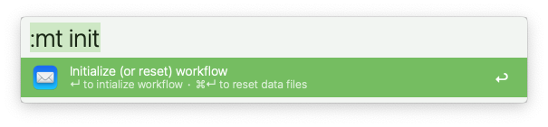
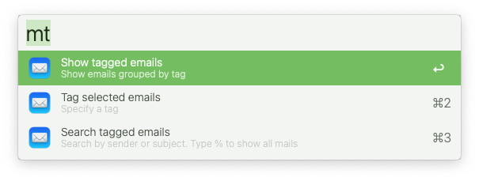
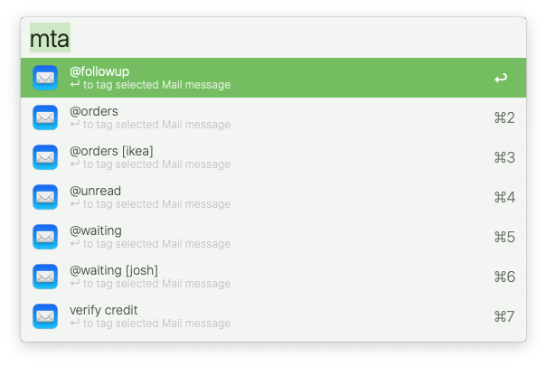
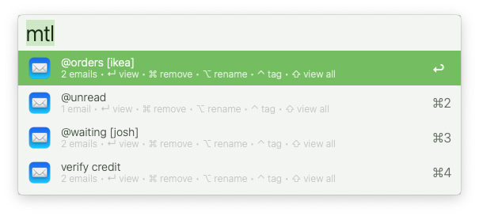
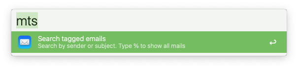
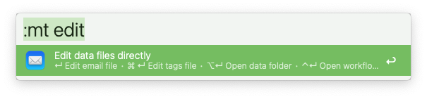

# Apple Mail Tags

Tag mails with a label since this does not exist in Apple Mail

▸  Requires [jq](https://formulae.brew.sh/formula/jq)

## Overview
A complete tagging system:  **<u>Apple Mail Tags</u>** | [Browser Bookmark Tags](https://github.com/modrocko/browser-bookmark-tags-alfred-workflow) | [Finder File Tags](https://github.com/modrocko/finder-file-tags-alfred-workflow)

### What sucks...

✘  Can't tag mails using Apple Mail, and...  
✘  Too silly keeping emails marked as *unread* for days  
✘  Too much time organizing emails in folders  
✘  Too confusing searching for *this & that*

### What doesn't...

✓  Tag any or many emails however you want — instantly  
✓  Organize, find & open any or many emails — instantly  
✓  Specify default tags or type your own — instantly  
✓  Keep your email sanity — always

## Usage

Here're the main functions for Apple Mail Tags using Alfred

*💡 **Tip**: Type '!' to mark & save tags as '❗' (high priority)*  

### Initialize workflow

❗Type `:mt init` to run this operation to start using this workflow

     

<kbd>↵</kbd> Initialize the workflow

<kbd>⌘</kbd> <kbd>↵</kbd> Reset data files *(will delete current data files)* 

### Show all Mail Tag options

Type `mt` to view top level functions

 

### Assign a tag

Type `mta` to view all tags *(defaults or previously specified tags)*

Select or type a new label to tag currently highlighted emails in Apple Mail

     

<kbd>↵</kbd> Tag selected email(s)

### List tagged emails

Type `mtl` to view a list of all items grouped by tag

  

<kbd>↵</kbd>  View all emails for selected tag

<kbd>⌘</kbd> <kbd>↵</kbd> Remove selected tag from all tagged emails

<kbd>⌥</kbd> <kbd>↵</kbd> Rename selected tag for all emails

<kbd>⌃</kbd> <kbd>↵</kbd> Tag currently highlighted emails for selected tag

<kbd>⇧</kbd> <kbd>↵</kbd> Open all emails for the selected tag

### Search tagged emails

Type `mts` to search through all tagged emails

  

<kbd>↵</kbd>  View email for selected item

<kbd>⌘</kbd> <kbd>↵</kbd> Remove tag from selected email

<kbd>⌥</kbd> <kbd>↵</kbd> Open the email and remove tag afterwards

<kbd>⌃</kbd> <kbd>↵</kbd> Reassign tag for selected email

### Apple Mail Tag utilities

Type `:mt edit` to edit data files (if needed) and open underlying folders

 

<kbd>↵</kbd>  Open email file for manual edits via TextEdit.app

<kbd>⌘</kbd> <kbd>↵</kbd> Open default tags file for manual edit via TextEdit.app

<kbd>⌥</kbd> <kbd>↵</kbd> Open the data folder for this workflow

<kbd>⌃</kbd> <kbd>↵</kbd> Open the workflow folder for this workflow
