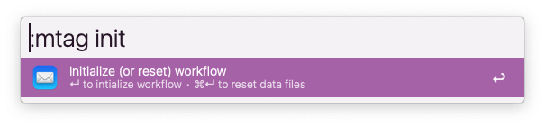
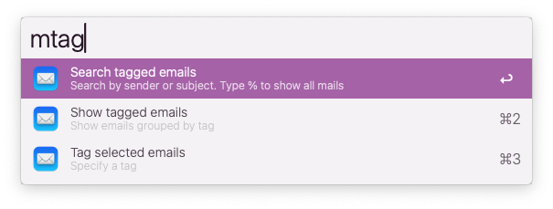
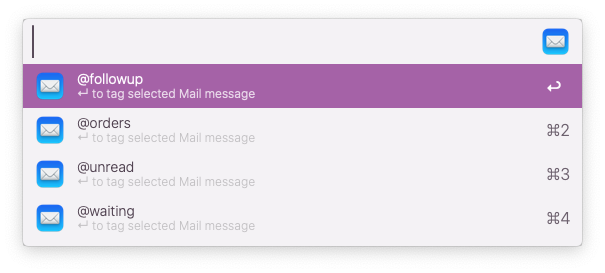
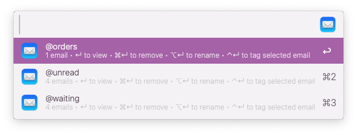
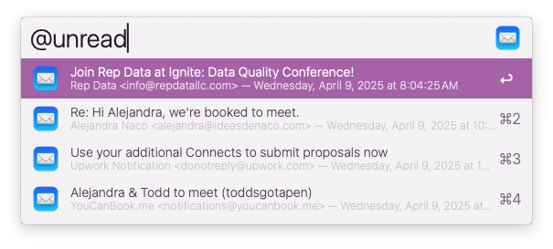
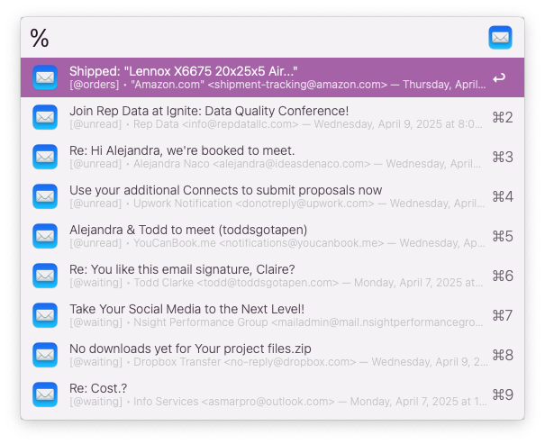

# Apple Mail Tags

Tag mails with a label since this does not exist in Apple Mail

▸  Requires [jq](https://formulae.brew.sh/formula/jq)  
▸  [Download workflow](https://github.com/modrocko/apple-mail-tags-alfred-workflow/releases/latest)

## Overview
▸ Tag selected email(s) in Apple Mail  
▸ View all emails for a selected tag  
▸ Search for email(s) based on sender or subject  
▸ Remove a tag from email(s)   
▸ Rename a tag  
▸ Set & manage a list of default tags  

## Usage

### Initialize workflow

Run this operation to start using this workflow

    

<kbd>↵</kbd> Initialize the workflow

<kbd>⌘</kbd> <kbd>↵</kbd> Reset data files *(will delete current data files)* 

### Show all Mail Tag options

View then choose an option

    

### Assign a tag

Select or type a new label to tag currently highlighted emails in Apple Mail

    

<kbd>↵</kbd> Tag selected email(s)

### List tagged emails

View a list of emails grouped by tag

  

<kbd>↵</kbd>  View all emails for selected tag

<kbd>⌘</kbd> <kbd>↵</kbd> Remove selected tag from all tagged emails

<kbd>⌥</kbd> <kbd>↵</kbd> Rename selected tag for all emails

<kbd>⌃</kbd> <kbd>↵</kbd> Tag currently highlighted emails for selected tag  

### View emails by tag

View a list of emails for selected tag above

    

<kbd>↵</kbd>  View selected email

<kbd>⌘</kbd> <kbd>↵</kbd> Remove this tag & all emails for this tag

<kbd>⌥</kbd> <kbd>↵</kbd> Reassign this tag for all associated emails 

<kbd>⌃</kbd> <kbd>↵</kbd> Tag currently highlighted emails with specified tag 

### Search tagged emails

Search all emails by subject or sender

    

Type % to show all tagged emails. Or type other characters to filter search results.

    

<kbd>↵</kbd>  View email for selected item

<kbd>⌘</kbd> <kbd>↵</kbd> Remove tag from selected email

<kbd>⌥</kbd> <kbd>↵</kbd> Open the email and remove tag afterwards

<kbd>⌃</kbd> <kbd>↵</kbd> Reassign tag for selected email

### Apple Mail Tag Utilities

Useful for some maintenance

    

<kbd>↵</kbd>  Open email .json file for manual edits via TextEdit.app

<kbd>⌘</kbd> <kbd>↵</kbd> Open default tags .json file for manual edit via TextEdit.app

<kbd>⌥</kbd> <kbd>↵</kbd> Open the workflow data folder for this workflow
